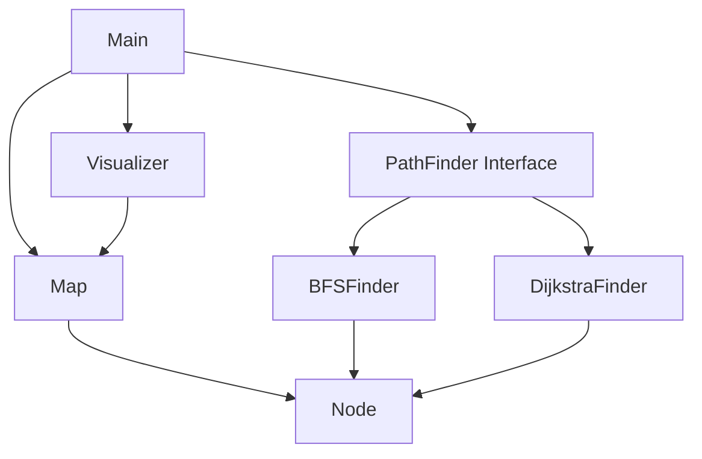
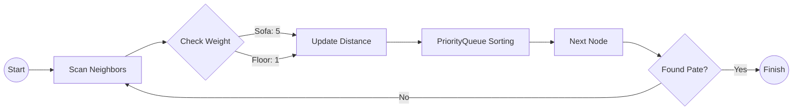

# 🌸 Mực Path Finder 🐱🍱

**English** | [Tiếng Việt](./README.md)

**Mực Path Finder** is a Java Console application that utilizes Data Structures and Algorithms (DSA) to help Mực (my cat) find the shortest/optimal path to a bowl of Pate in a maze full of obstacles.

## 🌟 Key Features
- 🧠 **Smart Algorithms**: Choose between BFS (shortest steps) and Dijkstra (optimal path - avoiding the Sofa).
- 🎬 **Vibrant Animation**: Step-by-step movement in the terminal with adorable emojis.
- 🎨 **"Everblush" Aesthetic**: Uses ANSI colors and balanced double-width icons for a premium look.
- 👿 **Apu Challenge**: Avoid the Apu obstacle to prevent Mực from being taken for a bath!
- **Realistic Emotions**: Mực displays premium ASCII Art (Grouchy Mực) when no path is found.

## 🏗️ System Architecture



## 🧠 Core Algorithms

### 1. BFS (Breadth-First Search)
Used for unweighted grids. The algorithm explores layer by layer to ensure the path with the minimum number of steps is found.

### 2. Dijkstra
Used for weighted grids (e.g., Sofa `S` has a weight of 5). Mực calculates the path with the lowest total "cost" rather than just counting steps.



## 📂 Folder Structure
```text
muc-path-finder/
├── src/main/java/com/muc/
│   ├── Main.java          # Scenario launcher
│   ├── models/            # Node, Map
│   ├── algorithms/        # BFS, Dijkstra, Interface
│   └── ui/                # Visualizer (Render & Animation)
└── src/main/resources/maps/ # Map configuration files (.txt)
```

## 🚀 How to Run
1. Ensure JDK 11+ is installed.
2. Open terminal at the project root.
3. Compile and run:
```bash
javac -d bin src/main/java/com/muc/models/*.java src/main/java/com/muc/algorithms/*.java src/main/java/com/muc/ui/*.java src/main/java/com/muc/*.java
java -cp bin com.muc.Main
```

---
Made with 💖 for Mực, Thư and Apu.
