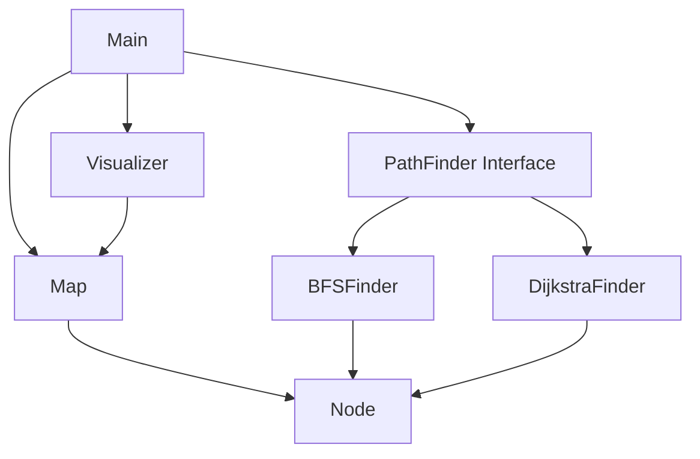
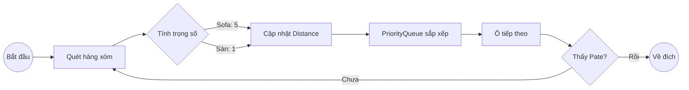

# 🌸 Mực Path Finder 🐱🍱

[English Version](./README-eng.md) | **Tiếng Việt**

**Mực Path Finder** là một ứng dụng Java Console sử dụng các thuật toán Cấu trúc dữ liệu và Giải thuật (DSA) để giúp Mực (con mèo cưng của tui) tìm đường ngắn nhất tới bát Pate trong một mê cung đầy thử thách.

## 🌟 Tính năng nổi bật
- 🧠 **Thuật toán thông minh**: Tùy chọn giữa BFS (đường ngắn nhất - ít bước) và Dijkstra (đường tối ưu - né Sofa).
- 🎬 **Animation sống động**: Hiệu ứng chuyển động từng bước trên Terminal với Emoji đáng yêu.
- 🎨 **Giao diện "Hệ Hồng Cánh Sen"**: Sử dụng mã màu ANSI bắt mắt và cân đối icon double-width.
- 👿 **Thử thách Apu**: Tránh né Apu để không bị "bế đi tắm" bất thình lình.
- **Cảm xúc thực tế**: Mực biết "quạu" (ASCII Art cực chuẩn) khi không tìm thấy đường đi.

## 🏗️ Kiến trúc hệ thống



## 🧠 Thuật toán trọng tâm

### 1. BFS (Breadth-First Search)
Dùng cho trường hợp map không trọng số. Thuật toán loang theo từng lớp để đảm bảo tìm được con đường có số bước ít nhất.

### 2. Dijkstra
Dùng cho trường hợp map có vật cản khó đi (như Sofa `S`). Mực sẽ tính toán để chọn con đường có tổng "chi phí" thấp nhất thay vì chỉ nhìn vào số bước.



## 📂 Cấu trúc thư mục
```text
muc-path-finder/
├── src/main/java/com/muc/
│   ├── Main.java          # Khởi chạy các kịch bản
│   ├── models/            # Node, Map
│   ├── algorithms/        # BFS, Dijkstra, Interface
│   └── ui/                # Visualizer (Render & Animation)
└── src/main/resources/maps/ # Các file bản đồ (.txt)
```

## 🚀 Cách chạy ứng dụng
1. Đảm bảo bạn đã cài đặt JDK 11+.
2. Mở Terminal tại thư mục gốc của dự án.
3. Biên dịch và chạy:
```bash
javac -d bin src/main/java/com/muc/models/*.java src/main/java/com/muc/algorithms/*.java src/main/java/com/muc/ui/*.java src/main/java/com/muc/*.java
java -cp bin com.muc.Main
```

---
Dự án được thực hiện với 💖 dành cho tui, Apu và Mực.
